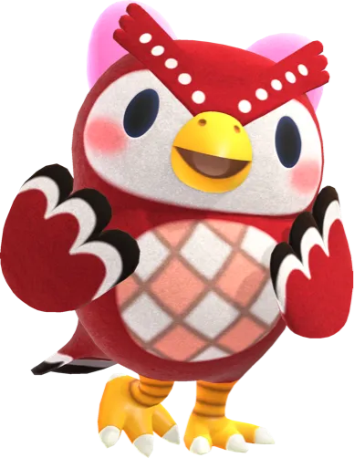
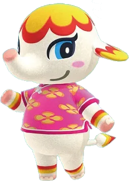

--- File: D:\게임모음\games\yut\game.js ---
// 윷놀이 게임 로직
const P1 = 0, P2 = 1;
const CELESTE = P1, SALLY = P2;

// 윷판 노드 위치 (29개 노드)
const nodes = [
    { id: 0, x: 92, y: 92, isCorner: true },   // 출발/도착
    { id: 1, x: 92, y: 75 }, { id: 2, x: 92, y: 58 }, { id: 3, x: 92, y: 42 }, { id: 4, x: 92, y: 25 },
    { id: 5, x: 92, y: 8, isCorner: true },    // 우상단
    { id: 6, x: 75, y: 8 }, { id: 7, x: 58, y: 8 }, { id: 8, x: 42, y: 8 }, { id: 9, x: 25, y: 8 },
    { id: 10, x: 8, y: 8, isCorner: true },    // 좌상단
    { id: 11, x: 8, y: 25 }, { id: 12, x: 8, y: 42 }, { id: 13, x: 8, y: 58 }, { id: 14, x: 8, y: 75 },
    { id: 15, x: 8, y: 92, isCorner: true },   // 좌하단
    { id: 16, x: 25, y: 92 }, { id: 17, x: 42, y: 92 }, { id: 18, x: 58, y: 92 }, { id: 19, x: 75, y: 92 },
    // 대각선 경로 (우상단 → 중앙)
    { id: 20, x: 75, y: 25 }, { id: 21, x: 60, y: 40 }, { id: 22, x: 50, y: 50, isCenter: true },
    { id: 23, x: 40, y: 60 }, { id: 24, x: 25, y: 75 },
    // 대각선 경로 (좌상단 → 중앙)
    { id: 25, x: 25, y: 25 }, { id: 26, x: 40, y: 40 }, { id: 27, x: 60, y: 60 }, { id: 28, x: 75, y: 75 }
];

// 경로 정의
const paths = {
    0: { default: 1 }, 1: { default: 2 }, 2: { default: 3 }, 3: { default: 4 }, 4: { default: 5 },
    5: { default: 6, shortcut: 20 },  // 우상단 코너 → 지름길 가능
    6: { default: 7 }, 7: { default: 8 }, 8: { default: 9 }, 9: { default: 10 },
    10: { default: 11, shortcut: 25 }, // 좌상단 코너 → 지름길 가능
    11: { default: 12 }, 12: { default: 13 }, 13: { default: 14 }, 14: { default: 15 },
    15: { default: 16 }, 16: { default: 17 }, 17: { default: 18 }, 18: { default: 19 }, 19: { default: 999 },
    // 대각선 경로
    20: { default: 21 }, 21: { default: 22 }, 22: { default: 23 }, 23: { default: 24 }, 24: { default: 15 },
    25: { default: 26 }, 26: { default: 22 }, 27: { default: 28 }, 28: { default: 999 }
};

const yutNames = { 1: "도", 2: "개", 3: "걸", 4: "윷", 5: "모", "-1": "빽도" };
let gameState = {
    turn: P1,
    pieces: { [P1]: [], [P2]: [] },
    movesAvailable: [],
    finishedCount: { [P1]: 0, [P2]: 0 }
};

function initGame() {
    const boardEl = document.getElementById('board');

    // 노드 생성
    nodes.forEach(node => {
        const el = document.createElement('div');
        el.className = `node ${node.isCorner ? 'corner' : ''} ${node.isCenter ? 'center' : ''}`;
        el.style.left = node.x + '%';
        el.style.top = node.y + '%';
        el.dataset.nodeId = node.id;
        boardEl.appendChild(el);
    });

    resetGame();

    // 윷 초기 위치
    for (let i = 0; i < 4; i++) {
        document.getElementById(`stick-${i}`).style.transform = `rotateX(0deg) rotateZ(${(Math.random() * 10) - 5}deg)`;
    }
}

function resetGame() {
    gameState = {
        turn: P1,
        pieces: {
            [P1]: Array(4).fill().map((_, i) => ({ id: i, loc: -1, finished: false })),
            [P2]: Array(4).fill().map((_, i) => ({ id: i, loc: -1, finished: false }))
        },
        movesAvailable: [],
        finishedCount: { [P1]: 0, [P2]: 0 }
    };

    document.getElementById('gameOverModal').classList.remove('show');
    document.getElementById('move-history').innerText = '';
    document.getElementById('p1-score').innerText = '0/4';
    document.getElementById('p2-score').innerText = '0/4';
    updateMessage('부엉이가 먼저 시작합니다! 윷을 던져주세요 🦉');
    renderPieces();
    enableThrowBtn(true);
    updatePlayerUI();
}

function throwYut() {
    enableThrowBtn(false);

    const sticks = [], shadows = [];
    for (let i = 0; i < 4; i++) {
        sticks.push(document.getElementById(`stick-${i}`));
        shadows.push(document.getElementById(`shadow-${i}`));
    }

    // 애니메이션 시작
    sticks.forEach(el => {
        el.classList.remove('anim-jump');
        void el.offsetWidth;
        el.classList.add('anim-jump');
        el.style.transition = 'transform 0.7s cubic-bezier(0.25, 1, 0.5, 1)';
        const rx = 720 + Math.random() * 360;
        const rz = 360 + Math.random() * 360;
        el.style.transform = `translateY(-120px) rotateX(${rx}deg) rotateZ(${rz}deg) scale(1.1)`;
    });
    shadows.forEach(el => {
        el.classList.remove('anim-shadow');
        void el.offsetWidth;
        el.classList.add('anim-shadow');
    });

    playThrowSound();

    setTimeout(() => {
        let flatCount = 0;
        sticks.forEach((stick) => {
            const isFlat = Math.random() < 0.5;
            if (isFlat) flatCount++;
            stick.innerHTML = `<svg class="yut-svg"><use href="${isFlat ? '#yut-flat' : '#yut-round'}"></use></svg>`;
            const landZ = (Math.random() * 20) - 10;
            stick.style.transition = 'transform 0.15s ease-out';
            stick.style.transform = `translateY(0) rotateX(0deg) rotateZ(${landZ}deg) scale(1)`;
        });

        // 결과 계산
        let result = flatCount === 0 ? 5 : flatCount;

        gameState.movesAvailable.push(result);
        const hist = document.getElementById('move-history');
        hist.innerHTML = `<span style="color:#5d4037; font-size:2rem;">${yutNames[result]}!</span>`;

        if (result === 4 || result === 5) {
            playSpecialSound();
            updateMessage(`[${yutNames[result]}] 한 번 더 던지세요!`);
            enableThrowBtn(true, "한 번 더!");
        } else {
            updateMessage("말을 클릭하여 이동하세요!");
            highlightMovablePieces();
        }

        setTimeout(() => {
            sticks.forEach(el => el.classList.remove('anim-jump'));
            shadows.forEach(el => el.classList.remove('anim-shadow'));
        }, 200);
    }, 650);
}

function enableThrowBtn(enable, text) {
    const btn = document.getElementById('btn-throw');
    btn.disabled = !enable;
    btn.innerText = text || "윷 던지기";
}

function highlightMovablePieces() {
    const player = gameState.turn;
    document.querySelectorAll(`.piece.p${player + 1}, .waiting-piece.p${player + 1}`).forEach(p => {
        p.classList.add('selectable');
        p.onclick = (e) => handlePieceClick(e, p);
    });
}

function handlePieceClick(e, domElement) {
    e.stopPropagation();
    if (gameState.movesAvailable.length === 0) return;

    const pid = parseInt(domElement.dataset.id);
    const piece = gameState.pieces[gameState.turn].find(p => p.id === pid);
    if (piece.finished) return;

    if (gameState.movesAvailable.length > 1) {
        showMoveSelection(piece);
    } else {
        executeMove(piece, gameState.movesAvailable[0], 0);
    }
}

function showMoveSelection(piece) {
    const msg = document.getElementById('messageArea');
    msg.innerHTML = '<span style="font-size:0.9rem;">이동할 칸 수를 선택하세요:</span><br>';

    gameState.movesAvailable.forEach((move, index) => {
        const btn = document.createElement('button');
        btn.innerText = `${yutNames[move]} (${move}칸)`;
        btn.className = 'btn';
        btn.style.margin = '5px';
        btn.style.background = '#8d6e63';
        btn.style.color = 'white';
        btn.onclick = (e) => {
            e.stopPropagation();
            executeMove(piece, move, index);
        };
        msg.appendChild(btn);
    });
}

function calculateDestination(currentLoc, steps) {
    let next = currentLoc === -1 ? 0 : currentLoc;

    for (let i = 0; i < steps; i++) {
        if (next === 999) break;
        const nodeData = paths[next];
        if (!nodeData) { next = 999; break; }

        // 출발 위치일 때만 지름길 선택
        if (next === currentLoc && nodeData.shortcut) {
            next = nodeData.shortcut;
        } else {
            next = nodeData.default;
        }
    }
    return next;
}

function getVisualLoc(loc) {
    return loc;
}

function executeMove(piece, steps, moveIndex) {
    playMoveSound();
    gameState.movesAvailable.splice(moveIndex, 1);

    // 함께 이동할 말 그룹
    const playerPieces = gameState.pieces[gameState.turn];
    let movingGroup = [];

    if (piece.loc === -1) {
        movingGroup = [piece];
    } else {
        const startLoc = piece.loc;
        movingGroup = playerPieces.filter(p => !p.finished && p.loc === startLoc);
    }

    const startLoc = piece.loc;
    let endLoc = calculateDestination(startLoc, steps);

    // 상대방 잡기
    let caught = false;
    if (endLoc !== 999 && endLoc !== -1) {
        const opponent = gameState.turn === P1 ? P2 : P1;
        gameState.pieces[opponent].forEach(opp => {
            if (!opp.finished && opp.loc === endLoc) {
                opp.loc = -1;
                caught = true;
            }
        });
    }

    // 위치 업데이트
    movingGroup.forEach(p => {
        p.loc = endLoc;
        if (endLoc === 999) p.finished = true;
    });

    // UI 정리
    document.querySelectorAll('.selectable').forEach(el => {
        el.classList.remove('selectable');
        el.onclick = null;
    });

    renderPieces();
    checkWinState(caught);
}

function checkWinState(caught) {
    const finished = gameState.pieces[gameState.turn].filter(p => p.finished).length;
    document.getElementById(gameState.turn === P1 ? 'p1-score' : 'p2-score').innerText = `${finished}/4`;

    if (finished === 4) {
        endGame(gameState.turn);
        return;
    }

    if (gameState.movesAvailable.length === 0) {
        if (caught) {
            playSpecialSound();
            updateMessage("상대 말을 잡았습니다! 한 번 더!");
            enableThrowBtn(true, "잡았다! 한 번 더");
        } else {
            switchTurn();
        }
    } else {
        updateMessage("남은 윷으로 이동하세요!");
        highlightMovablePieces();
    }
}

function switchTurn() {
    gameState.turn = gameState.turn === P1 ? P2 : P1;
    gameState.movesAvailable = [];
    enableThrowBtn(true);
    const name = gameState.turn === P1 ? "부엉이" : "샐리";
    updateMessage(`${name} 차례입니다. 윷을 던져주세요!`);
    updatePlayerUI();
}

function updatePlayerUI() {
    document.getElementById('player1').classList.toggle('active', gameState.turn === P1);
    document.getElementById('player2').classList.toggle('active', gameState.turn === P2);
}

function updateMessage(msg) {
    document.getElementById('messageArea').innerText = msg;
}

function renderPieces() {
    // 기존 말 제거
    document.querySelectorAll('.piece, .waiting-piece').forEach(el => el.remove());
    document.getElementById('p1-waiting').innerHTML = '';
    document.getElementById('p2-waiting').innerHTML = '';

    [P1, P2].forEach(player => {
        const pieces = gameState.pieces[player];
        const locCount = {};

        pieces.forEach(p => {
            if (p.finished) return;

            if (p.loc === -1) {
                // 대기 중인 말
                const div = document.createElement('div');
                div.className = `waiting-piece p${player + 1}`;
                div.innerText = p.id + 1;
                div.dataset.id = p.id;
                document.getElementById(player === P1 ? 'p1-waiting' : 'p2-waiting').appendChild(div);
            } else {
                // 판 위의 말
                const node = nodes.find(n => n.id === p.loc);
                if (node) {
                    if (!locCount[p.loc]) locCount[p.loc] = 0;
                    const offset = locCount[p.loc] * -5;
                    locCount[p.loc]++;

                    const el = document.createElement('div');
                    el.className = `piece p${player + 1}`;
                    el.dataset.id = p.id;
                    el.innerText = p.id + 1;
                    el.style.left = `calc(${node.x}% + ${offset}px)`;
                    el.style.top = `calc(${node.y}% + ${offset}px)`;
                    el.style.zIndex = 20 + locCount[p.loc];
                    document.getElementById('board').appendChild(el);
                }
            }
        });
    });
}

function endGame(winner) {
    const modal = document.getElementById('gameOverModal');
    const winnerAvatar = document.getElementById('winnerAvatar');
    const winnerText = document.getElementById('winnerText');

    if (winner === P1) {
        winnerAvatar.innerHTML = '';
        winnerText.textContent = '🎉 부엉이 승리! 🎉';
    } else {
        winnerAvatar.innerHTML = '';
        winnerText.textContent = '🎉 샐리 승리! 🎉';
    }

    modal.classList.add('show');
    createConfetti();
    playWinSound();

    if (typeof showVictoryVideo === 'function') {
        const winnerName = winner === P1 ? 'celeste' : 'sally';
        setTimeout(() => showVictoryVideo(winnerName), 800);
    }
}

function createConfetti() {
    const container = document.getElementById('confetti');
    container.innerHTML = '';
    const colors = ['#FF6B6B', '#4ECDC4', '#FFE66D', '#95E1D3', '#F38181', '#AA96DA'];

    for (let i = 0; i < 40; i++) {
        const confetti = document.createElement('div');
        confetti.className = 'confetti';
        confetti.style.left = Math.random() * 100 + '%';
        confetti.style.backgroundColor = colors[Math.floor(Math.random() * colors.length)];
        confetti.style.animationDelay = Math.random() * 2 + 's';
        if (Math.random() > 0.5) confetti.style.borderRadius = '50%';
        container.appendChild(confetti);
    }
}

// 효과음
function playThrowSound() {
    try {
        const ctx = new (window.AudioContext || window.webkitAudioContext)();
        [0.6, 0.65, 0.7].forEach(d => {
            const o = ctx.createOscillator(), g = ctx.createGain();
            o.connect(g); g.connect(ctx.destination);
            o.type = 'square'; o.frequency.value = 150;
            g.gain.setValueAtTime(0.15, ctx.currentTime + d);
            g.gain.exponentialRampToValueAtTime(0.01, ctx.currentTime + d + 0.08);
            o.start(ctx.currentTime + d); o.stop(ctx.currentTime + d + 0.1);
        });
    } catch (e) { }
}

function playMoveSound() {
    try {
        const ctx = new (window.AudioContext || window.webkitAudioContext)();
        const o = ctx.createOscillator(), g = ctx.createGain();
        o.connect(g); g.connect(ctx.destination);
        o.frequency.setValueAtTime(600, ctx.currentTime);
        o.frequency.exponentialRampToValueAtTime(200, ctx.currentTime + 0.1);
        g.gain.setValueAtTime(0.15, ctx.currentTime);
        g.gain.exponentialRampToValueAtTime(0.01, ctx.currentTime + 0.1);
        o.start(); o.stop(ctx.currentTime + 0.1);
    } catch (e) { }
}

function playSpecialSound() {
    try {
        const ctx = new (window.AudioContext || window.webkitAudioContext)();
        const o = ctx.createOscillator(), g = ctx.createGain();
        o.connect(g); g.connect(ctx.destination);
        o.type = 'triangle'; o.frequency.value = 523.25;
        g.gain.setValueAtTime(0.2, ctx.currentTime);
        g.gain.exponentialRampToValueAtTime(0.01, ctx.currentTime + 0.8);
        o.start(); o.stop(ctx.currentTime + 0.8);
    } catch (e) { }
}

function playWinSound() {
    try {
        const ctx = new (window.AudioContext || window.webkitAudioContext)();
        [523.25, 659.25, 783.99, 1046.50].forEach((freq, i) => {
            const o = ctx.createOscillator(), g = ctx.createGain();
            o.connect(g); g.connect(ctx.destination);
            o.type = 'triangle'; o.frequency.value = freq;
            g.gain.setValueAtTime(0.25, ctx.currentTime + i * 0.15);
            g.gain.exponentialRampToValueAtTime(0.01, ctx.currentTime + i * 0.15 + 0.4);
            o.start(ctx.currentTime + i * 0.15); o.stop(ctx.currentTime + i * 0.15 + 0.4);
        });
    } catch (e) { }
}

document.addEventListener('DOMContentLoaded', initGame);


--- File: D:\게임모음\games\yut\index.html ---
<!DOCTYPE html>
<html lang="ko">

<head>
    <meta charset="UTF-8">
    <meta name="viewport" content="width=device-width, initial-scale=1.0, maximum-scale=1.0, user-scalable=no">
    <title>🎲 윷놀이 🎲</title>
    <link rel="preconnect" href="https://fonts.googleapis.com">
    <link rel="preconnect" href="https://fonts.gstatic.com" crossorigin>
    <link href="https://fonts.googleapis.com/css2?family=Jua&family=Gamja+Flower&display=swap" rel="stylesheet">
    <link rel="stylesheet" href="style.css">
    <link rel="stylesheet" href="../../assets/victory-video.css">
</head>

<body>
    <!-- SVG 윷 정의 -->
    <svg style="display: none;">
        <defs>
            <linearGradient id="wood-dark" x1="0%" y1="0%" x2="100%" y2="0%">
                <stop offset="0%" stop-color="#3E2723" />
                <stop offset="20%" stop-color="#6D4C41" />
                <stop offset="50%" stop-color="#4E342E" />
                <stop offset="80%" stop-color="#3E2723" />
                <stop offset="100%" stop-color="#210f0b" />
            </linearGradient>
            <linearGradient id="wood-light" x1="0%" y1="0%" x2="100%" y2="0%">
                <stop offset="0%" stop-color="#FFF8E1" />
                <stop offset="100%" stop-color="#FFE0B2" />
            </linearGradient>
            <symbol id="yut-round" viewBox="0 0 44 120">
                <path d="M4,10 L40,10 L40,110 L4,110 Z" fill="rgba(0,0,0,0.2)" transform="translate(2,2)" />
                <path d="M2,10 Q22,-5 42,10 L42,110 Q22,125 2,110 Z" fill="url(#wood-dark)" stroke="#281A15"
                    stroke-width="1.5" />
                <g stroke="#D7CCC8" stroke-width="3" stroke-linecap="round" opacity="0.8">
                    <line x1="14" y1="25" x2="30" y2="40" />
                    <line x1="30" y1="25" x2="14" y2="40" />
                    <line x1="14" y1="55" x2="30" y2="70" />
                    <line x1="30" y1="55" x2="14" y2="70" />
                    <line x1="14" y1="85" x2="30" y2="100" />
                    <line x1="30" y1="85" x2="14" y2="100" />
                </g>
            </symbol>
            <symbol id="yut-flat" viewBox="0 0 44 120">
                <rect x="2" y="5" width="40" height="110" rx="4" fill="url(#wood-light)" stroke="#8D6E63"
                    stroke-width="2" />
                <path d="M10,10 Q25,60 10,110" stroke="#FFCC80" stroke-width="2" fill="none" opacity="0.6" />
                <path d="M34,10 Q19,60 34,110" stroke="#FFCC80" stroke-width="2" fill="none" opacity="0.6" />
                <circle cx="22" cy="60" r="14" stroke="#8D6E63" stroke-width="1.5" fill="none" opacity="0.3" />
            </symbol>
        </defs>
    </svg>

    <div class="game-container">
        <header class="header">
            <a href="../../index.html" class="back-button">🏠 홈으로</a>
            <h1>🎲 윷놀이 🎲</h1>
        </header>

        <!-- 플레이어 정보 -->
        <div class="players">
            <div class="player" id="player1">
                <div class="player-avatar">
                    
                </div>
                <div class="player-info">
                    <span class="player-name">부엉이</span>
                    <span class="score" id="p1-score">0/4</span>
                </div>
            </div>
            <div class="player" id="player2">
                <div class="player-avatar">
                    
                </div>
                <div class="player-info">
                    <span class="player-name">샐리</span>
                    <span class="score" id="p2-score">0/4</span>
                </div>
            </div>
        </div>

        <!-- 윷 던지기 영역 -->
        <div class="yut-area" id="yut-area">
            <div class="yut-mat">
                <div class="stick-wrapper">
                    <div class="stick-shadow" id="shadow-0"></div>
                    <div class="yut-stick" id="stick-0"><svg class="yut-svg">
                            <use href="#yut-round"></use>
                        </svg></div>
                </div>
                <div class="stick-wrapper">
                    <div class="stick-shadow" id="shadow-1"></div>
                    <div class="yut-stick" id="stick-1"><svg class="yut-svg">
                            <use href="#yut-round"></use>
                        </svg></div>
                </div>
                <div class="stick-wrapper">
                    <div class="stick-shadow" id="shadow-2"></div>
                    <div class="yut-stick" id="stick-2"><svg class="yut-svg">
                            <use href="#yut-round"></use>
                        </svg></div>
                </div>
                <div class="stick-wrapper">
                    <div class="stick-shadow" id="shadow-3"></div>
                    <div class="yut-stick" id="stick-3"><svg class="yut-svg">
                            <use href="#yut-round"></use>
                        </svg></div>
                </div>
            </div>
            <button id="btn-throw" class="btn btn-throw" onclick="throwYut()">윷 던지기</button>
        </div>

        <!-- 결과 표시 -->
        <div id="move-history" class="move-history"></div>

        <!-- 메시지 영역 -->
        <div class="message-area" id="messageArea">
            부엉이가 먼저 시작합니다! 윷을 던져주세요 🦉
        </div>

        <!-- 윷판 -->
        <div class="board-container" id="board">
            <svg width="100%" height="100%" class="board-lines">
                <line x1="8%" y1="8%" x2="92%" y2="92%" stroke="#5D4037" stroke-width="3" stroke-opacity="0.3" />
                <line x1="92%" y1="8%" x2="8%" y2="92%" stroke="#5D4037" stroke-width="3" stroke-opacity="0.3" />
                <rect x="6%" y="6%" width="88%" height="88%" rx="20" fill="none" stroke="#5D4037" stroke-width="5"
                    stroke-opacity="0.5" />
            </svg>
        </div>

        <!-- 대기 말 영역 -->
        <div class="waiting-areas">
            <div class="waiting-box p1-waiting">
                <div class="waiting-label">부엉이 대기</div>
                <div id="p1-waiting" class="waiting-pieces"></div>
            </div>
            <div class="waiting-box p2-waiting">
                <div class="waiting-label">샐리 대기</div>
                <div id="p2-waiting" class="waiting-pieces"></div>
            </div>
        </div>

        <!-- 컨트롤 -->
        <div class="controls">
            <button class="btn btn-restart" onclick="resetGame()">🔄 새 게임</button>
        </div>

        <!-- 게임 종료 모달 -->
        <div class="modal" id="gameOverModal">
            <div class="modal-content">
                <div id="confetti"></div>
                <div class="winner-avatar" id="winnerAvatar"></div>
                <h2 class="winner-text" id="winnerText"></h2>
                <button class="btn btn-play-again" onclick="resetGame()">🎮 다시 하기</button>
            </div>
        </div>
    </div>

    <script src="game.js"></script>
    <script src="../../assets/victory-video.js"></script>
</body>

</html>

--- File: D:\게임모음\games\yut\style.css ---
/* 윷놀이 게임 스타일 */
* {
    margin: 0;
    padding: 0;
    box-sizing: border-box;
}

:root {
    --bg-primary: #f3e5d0;
    --bg-secondary: #e6d5b8;
    --celeste-color: #C94C4C;
    --sally-color: #4488FF;
    --board-color: #e8d0a9;
    --wood-color: #5d4037;
    --text-primary: #4e342e;
    --yut-width: 40px;
    --yut-height: 100px;
}

body {
    font-family: 'Jua', sans-serif;
    background: linear-gradient(135deg, var(--bg-primary) 0%, var(--bg-secondary) 100%);
    min-height: 100vh;
    padding: 10px;
}

.game-container {
    max-width: 500px;
    margin: 0 auto;
    display: flex;
    flex-direction: column;
    gap: 10px;
}

/* Header */
.header {
    text-align: center;
    position: relative;
}

.back-button {
    position: absolute;
    left: 0;
    top: 50%;
    transform: translateY(-50%);
    background: white;
    border: none;
    padding: 6px 12px;
    border-radius: 15px;
    font-family: 'Jua', sans-serif;
    font-size: 12px;
    color: var(--text-primary);
    text-decoration: none;
    box-shadow: 0 2px 6px rgba(0, 0, 0, 0.1);
}

.header h1 {
    color: var(--text-primary);
    font-size: 1.8rem;
    font-family: 'Gamja Flower', cursive;
}

/* Players */
.players {
    display: flex;
    justify-content: space-between;
    gap: 10px;
}

.player {
    flex: 1;
    display: flex;
    align-items: center;
    gap: 8px;
    background: white;
    padding: 8px 12px;
    border-radius: 15px;
    box-shadow: 0 3px 10px rgba(0, 0, 0, 0.1);
    opacity: 0.6;
    transition: all 0.3s;
}

.player.active {
    opacity: 1;
    transform: scale(1.02);
    box-shadow: 0 5px 15px rgba(0, 0, 0, 0.15);
}

.player-avatar img {
    width: 40px;
    height: 40px;
    border-radius: 50%;
}

.player-info {
    display: flex;
    flex-direction: column;
}

.player-name {
    font-size: 0.9rem;
    color: var(--text-primary);
}

.score {
    font-size: 1.2rem;
    font-weight: bold;
    color: var(--wood-color);
}

/* Yut Area */
.yut-area {
    background: #d7ccc8;
    border-radius: 15px;
    padding: 15px;
    box-shadow: inset 0 3px 10px rgba(0, 0, 0, 0.1);
}

.yut-mat {
    display: flex;
    justify-content: center;
    gap: 15px;
    margin-bottom: 10px;
    perspective: 800px;
}

.stick-wrapper {
    position: relative;
    width: var(--yut-width);
    height: var(--yut-height);
}

.yut-stick {
    width: 100%;
    height: 100%;
    transform-style: preserve-3d;
    transform-origin: center center;
}

.stick-shadow {
    position: absolute;
    bottom: -8px;
    left: 10%;
    width: 80%;
    height: 8px;
    background: rgba(0, 0, 0, 0.3);
    border-radius: 50%;
    filter: blur(3px);
}

.yut-svg {
    width: 100%;
    height: 100%;
    display: block;
    filter: drop-shadow(1px 2px 3px rgba(0, 0, 0, 0.2));
}

/* Animations */
@keyframes jump-arc {
    0% {
        transform: translateY(0) scale(1);
    }

    40% {
        transform: translateY(-150px) scale(1.2);
    }

    70% {
        transform: translateY(0) scale(1);
    }

    85% {
        transform: translateY(-15px) scale(1);
    }

    100% {
        transform: translateY(0) scale(1);
    }
}

@keyframes shadow-scale {
    0% {
        transform: scale(1);
        opacity: 0.4;
    }

    40% {
        transform: scale(0.5);
        opacity: 0.1;
    }

    70% {
        transform: scale(1);
        opacity: 0.4;
    }

    100% {
        transform: scale(1);
        opacity: 0.4;
    }
}

.anim-jump {
    animation: jump-arc 0.7s forwards;
}

.anim-shadow {
    animation: shadow-scale 0.7s forwards;
}

/* Move History */
.move-history {
    min-height: 30px;
    display: flex;
    align-items: center;
    justify-content: center;
    font-size: 1.5rem;
    font-family: 'Gamja Flower', cursive;
    color: var(--text-primary);
}

/* Message Area */
.message-area {
    text-align: center;
    background: white;
    padding: 10px 15px;
    border-radius: 20px;
    font-size: 1rem;
    color: var(--text-primary);
    box-shadow: 0 3px 10px rgba(0, 0, 0, 0.1);
}

/* Board */
.board-container {
    position: relative;
    width: 100%;
    aspect-ratio: 1;
    background: var(--board-color);
    border-radius: 15px;
    box-shadow: 0 10px 25px rgba(0, 0, 0, 0.2);
    border: 8px solid var(--wood-color);
}

.board-lines {
    position: absolute;
    top: 0;
    left: 0;
    pointer-events: none;
}

.node {
    position: absolute;
    width: 7%;
    height: 7%;
    background: rgba(255, 255, 255, 0.4);
    border: 2px solid #795548;
    border-radius: 50%;
    transform: translate(-50%, -50%);
    z-index: 10;
}

.node.corner {
    width: 10%;
    height: 10%;
    background: rgba(255, 255, 255, 0.7);
    border-width: 3px;
    border-color: #3e2723;
}

.node.center {
    width: 12%;
    height: 12%;
    background: radial-gradient(circle, #fff 40%, #eee 100%);
    border-width: 3px;
    border-color: #3e2723;
}

/* Pieces */
.piece {
    position: absolute;
    width: 9%;
    height: 9%;
    border-radius: 50%;
    transform: translate(-50%, -50%);
    z-index: 20;
    display: flex;
    align-items: center;
    justify-content: center;
    font-size: 12px;
    color: white;
    font-weight: bold;
    box-shadow: 0 3px 6px rgba(0, 0, 0, 0.4);
    cursor: pointer;
    border: 2px solid rgba(255, 255, 255, 0.8);
    transition: all 0.3s;
}

.piece.p1 {
    background: radial-gradient(circle at 30% 30%, #ff6b6b, var(--celeste-color));
}

.piece.p2 {
    background: radial-gradient(circle at 30% 30%, #64b5f6, var(--sally-color));
}

.piece.selectable {
    animation: piece-bounce 0.6s infinite alternate;
    border: 3px solid #ffeb3b;
    z-index: 30;
    transform: translate(-50%, -50%) scale(1.2);
}

@keyframes piece-bounce {
    from {
        margin-top: 0;
    }

    to {
        margin-top: -8px;
    }
}

/* Waiting Areas */
.waiting-areas {
    display: flex;
    gap: 10px;
}

.waiting-box {
    flex: 1;
    background: white;
    padding: 8px;
    border-radius: 12px;
    text-align: center;
    box-shadow: 0 3px 10px rgba(0, 0, 0, 0.1);
}

.p1-waiting {
    border: 2px solid var(--celeste-color);
}

.p2-waiting {
    border: 2px solid var(--sally-color);
}

.waiting-label {
    font-size: 0.8rem;
    color: var(--text-primary);
    margin-bottom: 5px;
}

.waiting-pieces {
    display: flex;
    justify-content: center;
    gap: 5px;
    min-height: 35px;
}

.waiting-piece {
    width: 30px;
    height: 30px;
    border-radius: 50%;
    display: flex;
    align-items: center;
    justify-content: center;
    color: white;
    font-size: 12px;
    font-weight: bold;
    cursor: pointer;
    transition: transform 0.2s;
    border: 2px solid rgba(255, 255, 255, 0.8);
}

.waiting-piece:hover {
    transform: scale(1.1);
}

.waiting-piece.p1 {
    background: radial-gradient(circle at 30% 30%, #ff6b6b, var(--celeste-color));
}

.waiting-piece.p2 {
    background: radial-gradient(circle at 30% 30%, #64b5f6, var(--sally-color));
}

/* Buttons */
.controls {
    display: flex;
    justify-content: center;
    gap: 15px;
}

.btn {
    padding: 10px 20px;
    border: none;
    border-radius: 20px;
    font-family: 'Jua', sans-serif;
    font-size: 1rem;
    cursor: pointer;
    transition: all 0.2s;
}

.btn-throw {
    background: linear-gradient(to bottom, #8d6e63, #5d4037);
    color: white;
    border: 2px solid #4e342e;
    box-shadow: 0 4px 0 #3e2723;
    font-family: 'Gamja Flower', cursive;
    font-size: 1.3rem;
    width: 100%;
}

.btn-throw:active {
    transform: translateY(4px);
    box-shadow: 0 0 0 #3e2723;
}

.btn-throw:disabled {
    filter: grayscale(0.8);
    opacity: 0.7;
    cursor: not-allowed;
}

.btn-restart {
    background: linear-gradient(135deg, #4ECDC4, #44A08D);
    color: white;
    box-shadow: 0 4px 12px rgba(78, 205, 196, 0.4);
}

.btn:hover {
    transform: translateY(-2px);
}

/* Modal */
.modal {
    position: fixed;
    top: 0;
    left: 0;
    width: 100%;
    height: 100%;
    background: rgba(0, 0, 0, 0.7);
    display: flex;
    align-items: center;
    justify-content: center;
    opacity: 0;
    visibility: hidden;
    transition: all 0.3s;
    z-index: 1000;
}

.modal.show {
    opacity: 1;
    visibility: visible;
}

.modal-content {
    background: #fff8f0;
    padding: 30px;
    border-radius: 24px;
    text-align: center;
    border: 6px solid var(--wood-color);
    position: relative;
    overflow: hidden;
}

.winner-avatar img {
    width: 80px;
    height: 80px;
    border-radius: 50%;
    border: 4px solid #FFD700;
}

.winner-text {
    font-size: 1.8rem;
    color: var(--text-primary);
    font-family: 'Gamja Flower', cursive;
    margin: 15px 0;
}

.btn-play-again {
    background: linear-gradient(135deg, #FF6B6B, #FF8E8E);
    color: white;
}

/* Confetti */
#confetti {
    position: absolute;
    top: 0;
    left: 0;
    width: 100%;
    height: 100%;
    pointer-events: none;
    overflow: hidden;
}

.confetti {
    position: absolute;
    width: 10px;
    height: 10px;
    top: -10px;
    animation: confetti-fall 3s ease-out forwards;
}

@keyframes confetti-fall {
    to {
        transform: translateY(400px) rotate(720deg);
        opacity: 0;
    }
}

/* Responsive */
@media (max-width: 400px) {
    .header h1 {
        font-size: 1.5rem;
    }

    .player-avatar img {
        width: 30px;
        height: 30px;
    }

    .yut-mat {
        gap: 10px;
    }

    :root {
        --yut-width: 32px;
        --yut-height: 80px;
    }
}

IMPORTANT: Write your complete response to the file: D:\게임모음\.omc\prompts\codex-yut-analysis-result.md

# 윷놀이 게임 코드 분석 요청

아래 윷놀이 게임 코드를 분석해주세요. 이 게임은 아빠와 초2 딸이 갤럭시탭 S9+, 갤럭시 S23+에서 플레이합니다.

## 분석 관점

1. **게임 로직 버그**: 윷놀이 규칙에 맞지 않는 부분 (이동 경로, 잡기, 빽도 등)
2. **UX 문제점**: 터치 사용성, 반응형 디자인, 어린이 친화성
3. **코드 품질**: 구조적 문제, 성능, 유지보수성
4. **누락된 기능**: 윷놀이에서 중요한데 빠진 규칙이나 기능

## 윷놀이 규칙 체크리스트

- 윷(4칸)/모(5칸)일 때 추가 던지기 ✓
- 상대말 잡으면 추가 던지기 ✓
- 빽도(-1칸) 지원 여부?
- 말 업기(같은 위치 말 합치기) 지원 여부?
- 중앙(22번) 노드에서의 경로 선택 (좌하단 vs 우하단)
- 도착 직전 이동 계산 정확성
- 코너에서 지름길 진입 규칙

## game.js 코드

```javascript
// 윷놀이 게임 로직
const P1 = 0, P2 = 1;
const CELESTE = P1, SALLY = P2;

const nodes = [
    { id: 0, x: 92, y: 92, isCorner: true },
    { id: 1, x: 92, y: 75 }, { id: 2, x: 92, y: 58 }, { id: 3, x: 92, y: 42 }, { id: 4, x: 92, y: 25 },
    { id: 5, x: 92, y: 8, isCorner: true },
    { id: 6, x: 75, y: 8 }, { id: 7, x: 58, y: 8 }, { id: 8, x: 42, y: 8 }, { id: 9, x: 25, y: 8 },
    { id: 10, x: 8, y: 8, isCorner: true },
    { id: 11, x: 8, y: 25 }, { id: 12, x: 8, y: 42 }, { id: 13, x: 8, y: 58 }, { id: 14, x: 8, y: 75 },
    { id: 15, x: 8, y: 92, isCorner: true },
    { id: 16, x: 25, y: 92 }, { id: 17, x: 42, y: 92 }, { id: 18, x: 58, y: 92 }, { id: 19, x: 75, y: 92 },
    { id: 20, x: 75, y: 25 }, { id: 21, x: 60, y: 40 }, { id: 22, x: 50, y: 50, isCenter: true },
    { id: 23, x: 40, y: 60 }, { id: 24, x: 25, y: 75 },
    { id: 25, x: 25, y: 25 }, { id: 26, x: 40, y: 40 }, { id: 27, x: 60, y: 60 }, { id: 28, x: 75, y: 75 }
];

const paths = {
    0: { default: 1 }, 1: { default: 2 }, 2: { default: 3 }, 3: { default: 4 }, 4: { default: 5 },
    5: { default: 6, shortcut: 20 },
    6: { default: 7 }, 7: { default: 8 }, 8: { default: 9 }, 9: { default: 10 },
    10: { default: 11, shortcut: 25 },
    11: { default: 12 }, 12: { default: 13 }, 13: { default: 14 }, 14: { default: 15 },
    15: { default: 16 }, 16: { default: 17 }, 17: { default: 18 }, 18: { default: 19 }, 19: { default: 999 },
    20: { default: 21 }, 21: { default: 22 }, 22: { default: 23 }, 23: { default: 24 }, 24: { default: 15 },
    25: { default: 26 }, 26: { default: 22 }, 27: { default: 28 }, 28: { default: 999 }
};

const yutNames = { 1: "도", 2: "개", 3: "걸", 4: "윷", 5: "모", "-1": "빽도" };

// ... (전체 코드는 context_files에 포함)
```

## 중점 분석 포인트

1. `calculateDestination` 함수: 중앙(22)에서 경로 분기가 없음 - 항상 23으로만 감. 좌상단에서 온 경우 27로 가야 함
2. `paths` 객체: 22번 노드에서의 분기 처리 없음
3. 빽도(-1) 지원 없음
4. 말 업기 후 잡히면 업힌 말 전부 되돌아가는 처리
5. 0번(출발점)에서 완주 처리
6. 반응형 보드 크기 - 갤럭시탭에서 너무 작을 수 있음

## 개선 제안 요청

구체적인 코드 수정 방안을 제시해주세요:
- 버그 수정 우선순위
- UX 개선 사항
- 빠진 규칙 구현 방안
